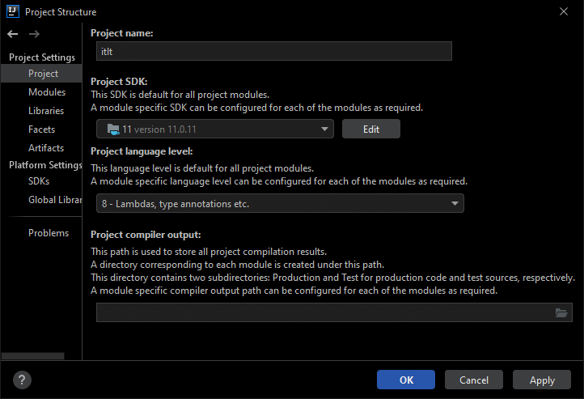
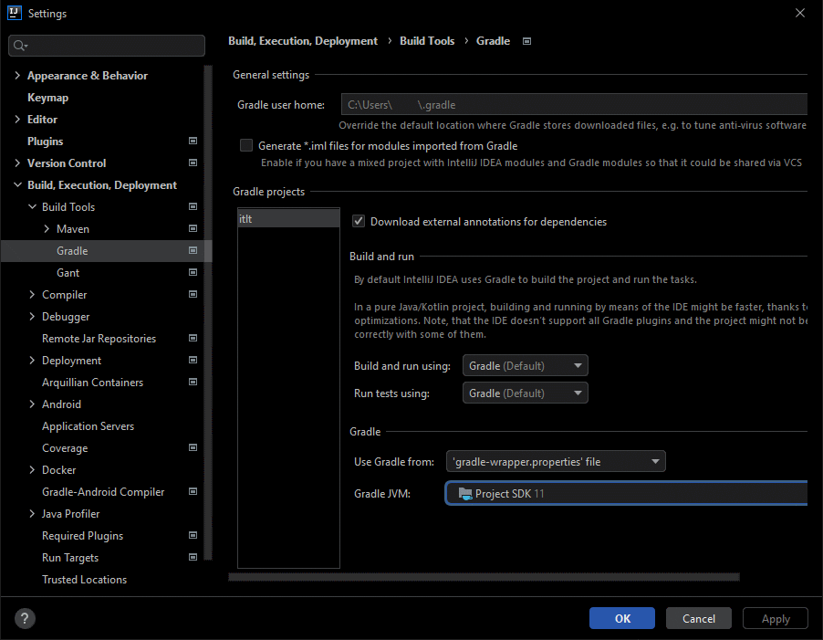

# Technical documentation

## Terminology

| Term        | Definition                                           |
| ----------- | ---------------------------------------------------- |
| itlt        | It's the little things (the name of this mod)        |
| FML         | Forge Mod Loader                                     |
| ForgeSPI    | Forge Service Provider Interfaces                    |
| Mixin(s)    | A coremodding utility by Mumfrey                     |
| Coremodding | The act of modifying core parts of the game directly |
| Req(s)      | Requirement(s)                                       |
| Warn(s)     | Warning(s)                                           |
| MC          | Minecraft                                            |

## Contents

-   [Introduction](#introduction)
-   [Main classes](#main-classes)
-   [Features](#features)
    -   [Java environment warnings and requirements system](#java-environment-warnings-and-requirements-system)
        -   [What?](#what)
        -   [Where?](#where)
        -   [Q&A](#qa)
        -   [How do I...](#how-do-i)
    -   [Branding customisation](#branding-customisation)
        -   [What?](#what-1)
        -   [Where?](#where-1)
        -   [Q&A](#qa-1)
        -   [How do I...](#how-do-i-1)
-   [To-do lists](#to-do-lists)
    -   [Things I still need to document here](#things-i-still-need-to-document-here)
    -   [Things left to-do with the existing code](#things-left-to-do-with-the-existing-code)
    -   [New features to consider adding later](#new-features-to-consider-adding-later)
-   [Troubleshooting](#troubleshooting)
    -   [Compiled file doesn't work on Java 8 or unable to build](#compiled-file-doesnt-work-on-java-8-or-unable-to-build)
    -   [Unable to start Gradle](#unable-to-start-gradle)

## Introduction

The "It's the little things" mod implements various miscellaneous features to the game, most of which are minor and targeted at modpacks. In other words, "It's the little things that add the finishing touches to your modpack".

This document is a technical overview and walkthrough for developers interested in contributing or simply for advanced users that are interested in how the mod works behind the scenes. I've wrote this because too often I find myself wanting to contribute something to an existing mod but get end up first needing to spend a while figuring out how it works due to differences in coding practices and program design.

**Don't worry, you're not expected to read all of this before contributing. It's just a "cheat sheet" that is intended for you to skim read the specific parts you care about if you want, to help you save time figuring out how the mod works.**

## Main classes

There are two main classes in this mod, one that is used when launching the mod inside a Forge environment (itlt.java), and one in a standard Java environment (Main.java).

This is because some of the features itlt uses involves making pop-up windows which cannot be done directly within a Minecraft game environment, the alternative is heavier coremodding which would be harder to maintain across Minecraft versions and more likely to break compatibility with other mods.

See the warnings feature brief for details on which to use and when. If you're not touching that feature, the itlt.java is probably the starting point you're looking for.

| Environment | Description                                                            | Main class |
| ----------- | ---------------------------------------------------------------------- | ---------- |
| Ingame      | Constructed when inside a Forge environment in the game                | itlt.java  |
| Plain Java  | Constructed when the jar's launched directly by `java -jar` or similar | Main.java  |

## Features

### Java environment warnings and requirements system

#### What?

-   Modpack authors can set requirements and warnings relating to the Java environment their pack is started in
    -   Requirements prevent the game from starting if not met and lets the user know why
    -   Warnings tell the player if something isn't ideal but still lets them play
        -   Warnings are not shown if the launcher the player's using doesn't allow them to change what the warning is asking for

#### Where?

-   Handled in `client.ClientModEvents#commonInit` (`FMLCommonSetupEvent`)
-   Has calls to:
    -   `ClientUtils#getJavaVersion()` to get normalised Java version (e.g. 1.8 -> 8, but 11 is still -> 11)
    -   `LauncherUtils#getDetectedLauncher()` to get the launcher used to start the game
    -   `ClientConfig` to grab config values related to the requirements and warnings system
    -   `ClientUtils#startUIProcess()` to show pop-ups as needed
-   Uses enums from:
    -   `client.helpers.Message.Content` (e.g. NeedsNewerJava, WantsNewerJava, NeedsLessMemory, etc...)
-   Uses classes that implement the following interfaces:
    -   `DetectedLauncher` (implemented by `CurseClient`, `Technic`, `MultiMC`, etc...)

#### Q&A:

-   Why not `FMLClientSetupEvent`?
    -   When a requirement isn't met the game is intentionally stopped. As such, using the FMLCommonSetupEvent which runs earlier helps avoid wasting people's time by letting them know if a requirement isn't met sooner than if I used the FMLClientSetupEvent here
-   What does `ClientUtils#startUIProcess()` do?
    -   It parses the `Message.Content` into a set of arguments and starts a new Java process which then executes the `Main.java` main class mentioned in the Main classes section
-   How does `ClientUtils#startUIProcess()` work?
    -   The `Message.Content` enum has almost all the details needed for the UI process, with the remaining filled in by context and some `ClientConfig` values
    1.  It generates translation keys based on the `Message.Content` and grabs some config values to fill in the gaps (non-translatable stuff such as guideURLs)
    2.  As resourcepacks aren't available during the `FMLCommonSetupEvent` stage, the language files for itlt are manually parsed and the translation keys are translated before being sent off to `Main.java` in another process
    3.  To keep things simple and to reduce the number of dependencies, `Main.java` always expects the same number and position of arguments being fed to it for the requirements and warnings system. Empty arguments have a "." inside.
    4.  A `ProcessBuilder` makes and starts the itlt mod jar itself which Java then resolves the `Main-Class` based on the MANIFEST.MF generated by the `jar { manifest { ... } }` section of the `build.gradle`
-   What does `Main.java` do?
    -   It uses the arguments fed to it to determine which pop-up window GUI to make with Swing
    -   If it detects it's on Windows, it tries some reflection to make it use the correct Windows iconography rather than an outdated one embedded inside the JDK in order to make the GUI look nicer and more native, with a graceful fallback
    -   Warning preferences (such as remembering "Don't warn about this again") are handled by `client.helpers.WarningPreferences` which `Main.java` `ClientUtils#startUIProcess()`
-   Why start a new Java process for showing the UI rather than calling `Main.java` directly?
    - LWJGL and AWT (which Swing is based on) do not play nice together on the same thread.
    - MacOS requires both to be on the first thread of a process to work properly.
    - Having the UI on a separate process allows the UI to persist after the game is stopped (needed for the requirements feature)
-   What does `WarningPreferences.java` do?
    -   It's a wrapper around `java.util.Properties` with support for booleans and creating the file if not already present
-   Why are the `isJava64bit` warning and requirements handled in `client.ClientModEvents#clientInit` (`FMLClientSetupEvent`) separate from all the rest?
    -   It calls `Minecraft#isJava64bit()` which isn't available until this stage in the mod loading process

#### How do I...

-   Add a new requirement?
    1. Add to the Subject and/or Desire enums in `client.helpers.Message`
    2. Add in the possible combinations in the Content enum. Use `Type.Needs`
    3. If your new requirement is based on a new environment type, add the detection/getter(s) for that in `ClientUtils`
    4. Add relevant config options to `ClientConfig`
    5. Handle it in `client.ClientModEvents#commonInit` or `client.ClientModEvents#clientInit` depending on how your environment detection is done
-   Add a new warning?
    -   Same as the requirement thing above but use `Type.Wants` instead of `Type.Needs` and consider any "selectivelyIgnore(yourWarningNameHere)Warning` config options if relevant
-   Change the GUI?
    -   Look at `Main.java` and adjust the Swing code as desired
    -   You can change args sent to the GUI through `ClientUtils#startUIProcess()`

### Branding customisation

#### What?

-   Modpack authors can add to the existing game's branding to help distinguish it from other modpacks on the same Minecraft version
    -   Window title can either be customised with a static string or to include placeholders such as "%autoName" to auto-detect based on how it's named in the launcher the game was started from. Or no custom window title at all if prefered (this'll keep the Vanilla one).
    -   Same with the custom icon - can either be:
        - Static icon based on a PNG file
        - Dynamic icon auto-detected by a supported launcher
        - Vanilla icon (no custom icon)

#### Where?

-   Handled in `client.ClientModEvents#clientInit` (`FMLClientSetupEvent`)
-   Has calls to:
    -   `ClientConfig` to grab config values related to branding customisation
    -   `LauncherUtils#getDetectedLauncher()` to get the launcher used to start the game
    -   `DetectedLauncher#getModpackDisplayName()` to get the modpack's user-friendly display name
    -   `DetectedLauncher#getModpackIcon()` to get the modpack's icon
    -   `ClientUtils#setWindowIcon()` to set the custom window icon
-   Uses classes that implement the following interfaces:
    -   `DetectedLauncher` (implemented by `CurseClient`, `Technic`, `MultiMC`, etc...)

#### Q&A:

-   How does `LauncherUtils#getDetectedLauncher()` work?
    -   Each launcher lays out the directory structure differently and manages isolating separate Minecraft installs in their own way.
    -   itlt uses this to detect what launcher started the game. For example, the Technic Launcher stores modpacks in a dedicated "modpacks" folder, MultiMC puts `mmc-pack.json` and `instance.cfg` files inside the install's `.minecraft` folder, and so on...
    -   If there's a better way of doing this I'd love to know. Checking the existance of stuff on file system isn't ideal.
    -   Once it has determined the launcher, it returns a new instance of the relevant launcher class that implements `client.launchers.DetectedLauncher`
        - Launcher classes that don't support a feature yet (such as getting the modpack's icon) should `return null` on the appropriate methods and itlt should handle it gracefully
        - The use of instancing and implementing an interface with a bunch of classes helps reduce the amount of logic code in this case as we don't need to check what launcher we're running on before running launcher-specific modpack display name detection code.
-   What does `Technic#getModpackDisplayName()` do?
    -   It parses the Technic Launcher's `cache.json` file for our packSlug and grabs the value associated to the `displayName` key
-   What does `MultiMC#getModpackDisplayName()` do?
    -   It parses the MultiMC `instance.cfg` file in the root `.minecraft` folder we're running from and grabs the value associated to the `name` key
-   What does `CurseClient#getModpackDisplayName()` do?
    -   It parses the `.minecraftinstance.json` and grabs the value associated to the `name` key
-   What's the inheritance model and how does it work in this case?
    -   `LauncherUtils#getDetectedLauncher()` returns a new instance of a class that implements DetectedLauncher.
    -   Said class `@Override`s relevant methods
    -   itlt does calls on your methods as it gets returned a `DetectedLauncher` type and knows what methods to call

#### How do I...

-   Add detection for another/new launcher?
    1. Determine what's unique about how the launcher organises modpacks
    2. Create a new class in `client.launchers` that `implements DetectedLauncher`
    3. Make `getModpackDisplayName()` and `getModpackIcon()` both `return null` and annotate them with `@Nullable` and `@Override` until you implement that functionality
    3. Add detection code to `LauncherUtils#getDetectedLauncher()` and return your launcher class added in step 2 if detected
-   Support custom window title auto-detection on an existing launcher?
    1. Determine how the launcher stores the friendly display name for the currently running modpack
    2. Implement `getModpackDisplayName()` in the existing launcher class you're interested in, found in `client.launchers` (e.g. `client.launchers.MultiMC`).
        - If you return null, itlt should fallback to `ClientConfig.autoDetectedDisplayNameFallback.get()`
-   Support custom window title auto-detection on a new launcher?
    -   First add detection for the new launcher, then follow the instructions for doing it on an existing launcher
-   Support custom icon auto-detection on an existing launcher?
    1. Determine how the launcher stores the icon for the currently running modpack
    2. Implement `getModpackIcon()` in the existing launcher class you're interested in, found in `client.launchers` (e.g. `client.launchers.Technic`).
        - If you return null, itlt should fallback to the file at `config\itlt\icon.png`. If that's also missing, it'll log a warning and carry on with the Vanilla icon
-   Support custom icon auto-detection on a new launcher?
    -   First add detection for the new launcher, then follow the instructions for doing it on an existing launcher

## To-do lists

### Things I still need to document here

-   Custom server list entries (found in `client.ClientModEvents#clientInit`)
-   Explicit GC (found in `client.ClientForgeEvents#onGuiOpen`)
-   Anti-cheat
    -   Server-side ModID blacklisting
    -   Client<->server negotiation
    -   Class checksumming
    -   Definition updates and caching
-   Mixins used
    -   FMLHandshakeHandlerMixin
    -   WindowTitleMixin
-   Icon resizing mechanism (found in `client.ClientUtils#setWindowIcon`)
-   Config declaration style (how config comments are laid out, the naming scheme for config keys, key structure such as `Java.Advanced.ExplicitGC`...)

### Things left to-do with the existing code

-   Write up website guides and make them the warning system defaults rather than pointing to the placeholder "https://ozli.ga"
-   Verify guide URLs in the config and actually make sure they start with "https://"
-   Add Forge updateChecker support (mods.toml's updateJSONURL)

### New features to consider adding later

-   Support for GDLauncher and SKLauncher
-   Account for modpack authors setting the max memory or java requirement lower than the min and enabling both, making it impossible to satisfy
-   Config option to launch the game in fullscreen by default (while still respecting the player's choice in video settings menu if they change it)
-   Being able to IMC to the itlt mod and get a crash report back if it was your fault (useful for other mods)
-   Optional mods
    -   Show a GUI before the game has finished loading if jars have a file name ending in ".optional" (i.e. "modid.optional.jar" or "modid.optional.jar.disabled") and toggle the ".disabled" file extension before mod loading depending on the user's preference on first launch
    -   Add a client-side command, menu button or at least a config option for users to toggle so they can get the optional mods prompt again if they change their mind about any of their selection
    -   Be smart enough to also enable dependencies for optional mods when needed
-   Server list menu system
    - When joining a server that also has itlt and has this feature configured, instead of joining into a world on a hub server, show another screen similar to the server list but with a list of servers offered by said hub server
    - The idea is that you can bypass a server's hub world and quickly join any of the servers through a multiplayer server list-like menu rather than running around a hub world
    - Server hub replies with a json of IPs and Names on join and kicks player. Client renders and shows a separate multiplayer server list containing only the entries from the server hub's json with a button to go back to the main server list
-   Support Java 8 build number detection and requirements/warnings/etc (e.g. Java 8u51, Java 8u200, etc...)
-   Support Vanilla's window title changing depending on what you're doing (e.g. "Minecraft 1.16.5 (Multiplayer)" when you click Multiplayer). Currently it's static and stays the same as when you first start the game.
-   Anti-piracy feature (detect and block known pirated launchers by default)
-   Redo the anti-cheat stuff
    -   It works, but there's lots of signs of me trying to get it all to work and trying new concepts in-place rather than in isolation. The whole thing could do with a cleanup really
    -   Measure if there's actually a performance benefit for using BLAKE3-JNI instead of the pure Java implementation or if the overhead of JNI and the benefits of JVM's JIT narrows the gap. If there isn't much perf benefit then removing it from being shadowed would be good.

## Troubleshooting

### Compiled file doesn't work on Java 8 or unable to build

Make sure you set the project SDK to 11 and the language level to 8. It's important that you set both correctly, otherwise you may end up accidentally building a jar that only runs on Java 11+!

In IntelliJ, you can do this by going to `File -> Project Structure`. It should look like this:

### Unable to start Gradle

Run Gradle with Java 8 to 15 inclusive. Using Java 16 isn't supported yet but is being worked on with ForgeGradle 5. I'll update the buildscript to ForgeGradle 5 and Gradle 7 once available.

In IntelliJ, you can do this by going to `File -> Settings -> Build, Execution, Deployment -> Build Tools -> Gradle` and set the Gradle JVM to "Project SDK", which should be version 11 from the previous troubleshooting step. It should look like this:
